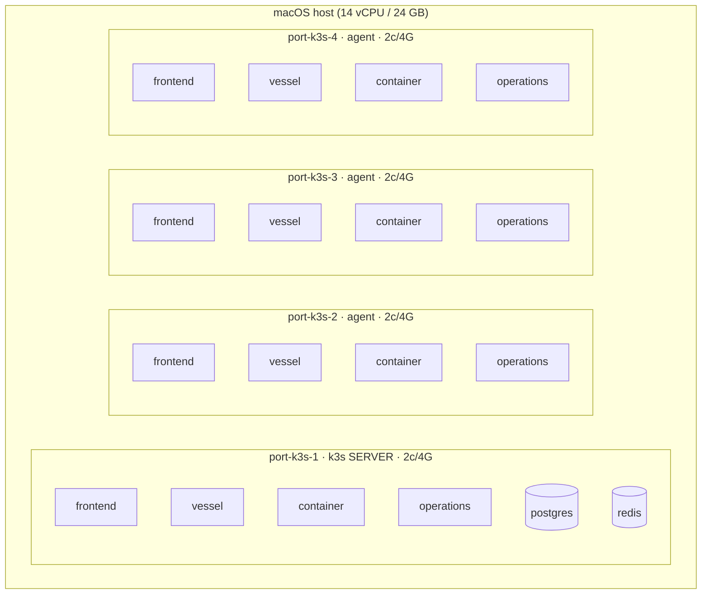

# Port Ops Demo — Multipass / k3s multi-node deployment path

An alternative to the single-node minikube path (`Java/k8s`). This one stands up a
**4-VM k3s cluster with [Multipass](https://multipass.run/)** and scatters the
application replicas **evenly, one per VM**, so the demo looks and behaves like a
real multi-node Kubernetes cluster. Splunk Observability Cloud and AppDynamics
instrumentation are wired in as a **later phase** (see below) — this path just
gives them a roomy multi-node cluster to attach to.

## Why this path

| | minikube path (`Java/k8s`) | multipass path (this folder) |
|---|---|---|
| Nodes | 1 | 4 (1 server + 3 agents) |
| Replicas | 1 each | 4 each, 1 per node |
| Scheduling | single node | `topologySpreadConstraints`, even scatter |
| Headroom for dual agents | tight (OOM risk) | comfortable (8 vCPU / 16 GB total) |

> Single-node minikube overcommitted when running **both** the Splunk OTel and
> AppD Java agents per pod (mem limits hit 121 %, OOM restarts). Spreading across
> 4 VMs is what makes the "later" observability phase safe.

## Topology



Each of the 4 application services runs **4 replicas** with a
`topologySpreadConstraints` (`maxSkew: 1`, `topologyKey: kubernetes.io/hostname`,
`whenUnsatisfiable: DoNotSchedule`) → exactly **one replica per VM**. `postgres`
and `redis` are singletons pinned to the server node (`port-ops/role=server`) so
the local-path volume stays put across reschedules.

## Layout

```
multipass_k8s/
├── cloud-init/
│   ├── k3s-server.yaml   # server node (template: @@K3S_TOKEN@@)
│   └── k3s-agent.yaml    # agent nodes (template: @@K3S_TOKEN@@, @@K3S_URL@@)
├── k8s/
│   └── kustomization.yaml# reuses ../../k8s/base + replicas + spread + pins
└── scripts/
    ├── lib.sh            # shared config (VM names, sizes, image tags)
    ├── up.sh             # launch 4 VMs, form cluster, write ../kubeconfig
    ├── load-images.sh    # docker save → transfer → k3s ctr images import (×4 nodes)
    ├── deploy.sh         # create secret + kubectl apply -k k8s + rollout + spread report
    ├── smoke-test.sh     # node/replica-spread check + frontend health
    └── down.sh           # multipass delete + purge  (--clean removes creds)
```

## Prerequisites

- [Multipass](https://multipass.run/) (`brew install --cask multipass`) — verified with 1.16.x
- Docker (to build the app images on the host)
- `kubectl`, `openssl`, `curl`

## Quick start

```bash
cd Java/multipass_k8s

# 1. Stand up the 4-VM k3s cluster (writes ./kubeconfig)
./scripts/up.sh
export KUBECONFIG="$PWD/kubeconfig"

# 2. Build the app images on the host (once), then push them into every node
(cd .. && ./scripts/build-images.sh)
./scripts/load-images.sh

# 3. Deploy (creates the postgres secret, applies the overlay, waits for rollout)
./scripts/deploy.sh

# 4. Verify the even spread + health
./scripts/smoke-test.sh
```

Open the UI at `http://<any-node-ip>:31080` (NodePort), or port-forward:

```bash
kubectl -n port-ops-demo port-forward svc/frontend 9080:9080
```

Tear down:

```bash
./scripts/down.sh          # delete + purge the 4 VMs (keeps ./kubeconfig etc.)
./scripts/down.sh --clean  # also remove token / kubeconfig / password files
```

## How the cluster forms

1. `up.sh` generates a per-cluster join token (`.k3s-token`, git-ignored).
2. The **server** cloud-init installs k3s with `--disable traefik` and leaves the
   node schedulable, so all 4 VMs run app pods.
3. `up.sh` discovers the server's IPv4, renders the **agent** cloud-init with that
   address + the shared token, and launches the 3 agents to join.
4. The server's kubeconfig is copied to `./kubeconfig` with `127.0.0.1` rewritten
   to the server IP so host `kubectl` can reach it.

Images: k3s uses **containerd**, so host-built `localhost/port-ops-demo/*:0.1.0`
images are streamed into each node with `k3s ctr images import` (no registry
needed). `postgres:16` and `redis:7-alpine` are pulled from Docker Hub by the VMs.

## Phase 2 (later): Splunk O11y + AppDynamics

The cluster is intentionally sized with headroom for both agents. When ready:

- **Splunk Observability** — the existing `Java/scripts/splunk-instrumentation.sh`
  operates on the current kubectl context, so it works unchanged against this
  cluster once `KUBECONFIG=$PWD/kubeconfig` is exported (installs the Splunk OTel
  Collector Helm chart + the operator `Instrumentation` CR that injects the OTel
  Java agent). Remember to stamp `deployment.environment` on the instrumentation
  resource (not the collector) so Secure App findings are visible.
- **AppDynamics** — apply the operator + Cluster Agent from `cluster-agent.yaml`
  (repo root) and the bundle in `Java/cluster-agent-scratch-arm64-bundled-distribution/`.
  Account is `se-lab`; APM Tier B auto-instrumentation coexists with the Splunk OTel
  agent on the same JVM.

> Not wired in this path yet — run these only when you move to the observability
> phase. Nothing here blocks it.

### Refreshing the collector after a new HEC token / URL

Once the Splunk Cloud logs layer is on (`Java/scripts/splunk-logs.sh`), a **new HEC instance**
(new token and/or endpoint) does not need a reinstall — refresh the running collector in place.
Make sure `KUBECONFIG=$PWD/kubeconfig` is exported so the scripts target this cluster:

1. Update `Java/scripts/splunk-integration.env`:

   ```bash
   export SPLUNK_HEC_TOKEN="<new-token>"                         # raw value or op:// ref
   export SPLUNK_HEC_URL="https://<host>:8088/services/collector" # full endpoint incl. /services/collector
   ```

   Set `SPLUNK_HEC_URL` explicitly for a standalone/Enterprise HEC (only Splunk Cloud stacks derive
   the `http-inputs-<stack>.splunkcloud.com` default).

2. Re-run `enable` (rewrites the collector secret + `helm upgrade --reuse-values` with the new
   endpoint, keeping O11y settings), then verify:

   ```bash
   cd ..                                     # Java/ — where scripts/ lives
   ./scripts/splunk-logs.sh enable           # add --dry-run first to preview
   ./scripts/splunk-logs.sh verify
   ```

3. If only the secret changed (no template diff), force the collector pods to reload the token:

   ```bash
   kubectl rollout restart daemonset,deployment \
     -n port-ops-demo -l app.kubernetes.io/instance=splunk-otel-collector
   ```

